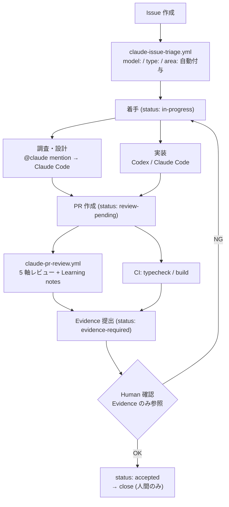

# claude-project-template

## どんな問題を解くか

Claude Code と Codex を 1 人開発で併用すると、こういうことが起きる:

- **作業状態が散らばる** — どの Issue を誰が持っているか、どこまで進んだか、ローカルファイルや Slack にしか残らない
- **責任境界が曖昧になる** — 「Claude に頼んだがどこまでやったか分からない」「Codex が途中で止まったまま放置」
- **レビューが属人化する** — PR を誰がいつ何の軸でレビューしたか残らない。自分だけでは見落とす

このテンプレは **GitHub Issues を唯一の状態管理軸**として、AI の入出力・担当切り替え・完了判定を機械的にコントロールする仕組みを提供する。AI のコードは触らず、**ガバナンスだけを持ち込む**のが特徴。

---

## 全体フロー



### 実例

このテンプレ自身の運用ログを実例として参照可能:

- **Issue triage**: [#14 bootstrap.md](https://github.com/FUMIHITO-EGUCHI/claude-project-template/issues/14) — `model: standard` / `type: feature` / `area: handoff` が自動付与された例
- **5 軸 PR レビュー**: [#12 dummy PR for Learning notes](https://github.com/FUMIHITO-EGUCHI/claude-project-template/pull/12) — `claude-pr-review.yml` が correctness / readability / architecture / security / performance + Learning notes を投稿した例
- **ADR-0003 駆動の連動 Issue 群**: [#5](https://github.com/FUMIHITO-EGUCHI/claude-project-template/issues/5) / [#7](https://github.com/FUMIHITO-EGUCHI/claude-project-template/issues/7) / [#8](https://github.com/FUMIHITO-EGUCHI/claude-project-template/issues/8) — Human acceptance + Learning loop を段階導入した記録

---

## 何が入っているか

| ファイル / ディレクトリ | 役割 |
|---|---|
| `CLAUDE.md` / `AGENTS.md` | 行動原則と AI 役割分担 |
| `.claude/rules/` | handoff / TypeScript / Windows encoding の path-scoped ルール |
| `.github/ISSUE_TEMPLATE/` | Task / Bug / Investigation テンプレ（Evidence of acceptance + strong-signals チェックボックス付き） |
| `.github/labels.yml` + sync workflow | 6 軸ラベル（status / model / owner / priority / type / area）を GitHub に自動同期 |
| `.github/workflows/claude-issue-triage.yml` | Issue 作成時に model: / type: / area: を自動付与 |
| `.github/workflows/claude-mention.yml` | @claude メンションで応答（質問 / 調査 / 実装、track_progress 付き） |
| `.github/workflows/claude-pr-review.yml` | PR 作成時に 5 軸レビュー + Learning notes |
| `docs/handoff/` | GitHub Issues ベース handoff 運用ガイド + AI 実行制御 |
| `docs/decisions/` | ADR ひな形 + 参考 ADR（Issue SoT / Human acceptance / Learning loop） |
| `scripts/` | init-project.sh / commit-msg hook（`#<issue>` 強制）/ sync-labels |

---

## 使い方

詳細な手順は **[`docs/handoff/bootstrap.md`](docs/handoff/bootstrap.md)** に集約してある。最短ルート:

```sh
# 1. テンプレから新 PJ を作成
gh repo create <owner>/<new-pj> --template FUMIHITO-EGUCHI/claude-project-template --private --clone
cd <new-pj>

# 2. プレースホルダ置換 + hooks + ラベル同期
sh scripts/init-project.sh "<pj名>" "<説明>"

# 3. Claude Code CLI で GitHub App 連携
/install-github-app
# → CLAUDE_CODE_OAUTH_TOKEN secret が自動登録される
# → 自動生成された claude-code-review.yml は削除（claude-pr-review.yml と重複）

# 4. CLAUDE.md の @stack:replace ブロックを実スタックで埋める
grep -rn '@stack:replace' .
```

---

## ラベル

### status:（Issue の状態遷移）

| ラベル | 意味 |
|---|---|
| `status: todo` | 未着手 |
| `status: in-progress` | 作業中 |
| `status: blocked` | ブロック中 |
| `status: review-pending` | PR 作成済み、AI レビュー待ち |
| `status: evidence-required` | レビュー通過、Evidence 提出済み、人間 acceptance 待ち |
| `status: accepted` | 人間が Evidence を確認して OK。close 待ち |
| `status: ready-for-close` | 旧フロー互換。新規 Issue は上記6状態を使う |

### model:（AI モデル選定）

| ラベル | 使う場面 |
|---|---|
| `model: cheap-ok` | 候補抽出 / 整形 / 要約 / 単純 rename |
| `model: standard` | 既存パターンに沿った実装 / テスト追加 / 型修正 |
| `model: strong-required` | 認可 / DB / 状態管理 / 曖昧仕様 / 根本原因調査 / 不可逆変更 |

判定根拠は `task.yml` の "強いモデルを要する兆候" チェックボックス。

### 振り返り用

| ラベル | 使う場面 |
|---|---|
| `cost: overrun` | 想定より燃えた |
| `model: was-overkill` | strong を使ったが standard で足りた |

### その他

| 軸 | 値 |
|---|---|
| `owner:` | `claude` / `codex` / `human` |
| `priority:` | `high` / `medium` / `low` |
| `type:` | `feature` / `bug` / `investigation` / `refactor` |
| `area:` | プロジェクトごとに `.github/labels.yml` を編集 |

---

## 設計判断（ADR）

- **ADR-0001**: Template repository 戦略
- **ADR-0002**: GitHub Issues を single source of truth にする（`docs/decisions/0002-github-operation-sot.md`）
- **ADR-0003**: Human acceptance 3点ゲートと Learning loop（`docs/decisions/0003-human-acceptance-and-ai-tutor.md`）
